# DataSentinel

**DataSentinel** is a cloud-native **data quality enforcement platform** that guards data pipelines by validating, cleaning, profiling, converting, and intelligently processing datasets **before they reach analytics or machine learning systems**.

Instead of debugging broken dashboards and unreliable models downstream, DataSentinel stops bad data **at the gate**.

---

## Why DataSentinel?

> “Modern enterprises don’t just need pipelines — they need **trust in their data**.”

Most data failures happen **upstream**, caused by:
- inconsistent schemas
- missing or malformed values
- dirty CSV files
- silent data corruption
- manual, error-prone fixes

**DataSentinel enforces data correctness before data is consumed**, so analytics, reporting, and ML systems remain reliable.

---

## Core Capabilities

- **Data Validation**  
  Enforces schema, data types, and required columns. Invalid data is rejected early.

- **Normalization**  
  Cleans and standardizes raw data into consistent, analytics-ready formats.

- **Conversion**  
  Converts CSV datasets into Parquet for faster queries and lower storage costs.

- **Profiling**  
  Auto-generates data reports with summary statistics and distribution insights.

- **Prediction**  
  Applies machine learning classification as part of the data enforcement flow.

- **Interactive Dashboard**  
  Clear visibility into what ran, what failed, and why.

- **Stripe Subscriptions**  
  SaaS-ready billing with Pro-tier access.

---

## Tech Stack

| Category        | Technologies                                                               |
| --------------- | -------------------------------------------------------------------------- |
| Backend         | **FastAPI**, **SQLAlchemy**, **Authlib (OAuth)**                           |
| Frontend        | **Jinja2 Templates**, **Tailwind CSS**, **Chart.js**                       |
| Cloud & Storage | **Google Cloud Run**, **Google Cloud Storage**, **Pub/Sub**, **Terraform** |
| ML / Data       | **Pandas**, **Scikit-learn**                                               |
| Database        | **Supabase PostgreSQL**                                                    |
| Payment         | **Stripe** (Webhooks + Checkout)                                           |
| Auth            | **Google OAuth 2.0**                                                       |

---

## Architecture Overview

DataSentinel uses an **event-driven, microservice-based architecture** designed for scalability, fault isolation, and cost efficiency.

Each dataset upload triggers independent services that enforce data quality without cascading failures.

```mermaid
graph TD

    A[👤 User Uploads File] --> B["📁 GCS Central Bucket (Raw Uploads)"]
    B --> C["📨 Pub/Sub Trigger"]
    C --> D["⚡ Eventarc"]

    D --> E1["🚀 Cloud Run: Validation"]
    D --> E2["🚀 Cloud Run: Normalization"]
    D --> E3["🚀 Cloud Run: Conversion"]
    D --> E4["🚀 Cloud Run: Profiling"]
    D --> E5["🚀 Cloud Run: Prediction"]

    subgraph "🧠 DataSentinel Services"
        E1 --> F1["Reject / Approve"]
        E2 --> F2["Clean & Standardize"]
        E3 --> F3["CSV → Parquet"]
        E4 --> F4["Generate Reports"]
        E5 --> F5["Run ML Models"]
    end

    F1 --> G["📦 User GCS Bucket (Processed Data)"]
    F2 --> G
    F3 --> G
    F4 --> G
    F5 --> G

    F1 --> DB["🗃️ Supabase PostgreSQL"]
    F2 --> DB
    F3 --> DB
    F4 --> DB
    F5 --> DB

    DB --> H["📊 Dashboard & Reports"]

```



## Live Demo

> 🌐 **Live URL:** [datasentinel.srslogics.com](https://datasentinel.srslogics.com)

Use Google OAuth to log in and explore all modules. For demo Stripe payments, use:

```
Card: 4242 4242 4242 4242
Exp: Any future date
CVC: Any 3 digits
```

---

## Modules & Routes

| Module        | Endpoint                                      | Description                       |
| ------------- | --------------------------------------------- | --------------------------------- |
| Auth          | `/login`, `/auth/callback`                    | Google OAuth 2.0 Login            |
| Validation    | `/validate`, `/columns`                       | File-based schema and data check  |
| Normalization | `/normalize`, `/normalize-file`               | Standardizes data formats         |
| Conversion    | `/convert`                                    | CSV to Parquet conversion         |
| Prediction    | `/predict`                                    | ML predictions on normalized data |
| Profiling     | `/profile`                                    | Data profiling reports            |
| Dashboard     | `/dashboard`                                  | Interactive stats and graphs      |
| Subscription  | `/subscription`, `/subscribe/pro`, `/success` | Stripe Pro Plan                   |

---

## Setup Instructions

```bash
# 1. Clone the repo
git clone https://github.com/yourusername/datum-sync.git
cd datum-sync

# 2. Create a virtual environment & install dependencies
python -m venv venv
source venv/bin/activate
pip install -r requirements.txt

# 3. Set up .env for secrets
cp .env.example .env  # Add your GCP, Supabase, and Stripe keys

# 4. Run locally
uvicorn main:app --reload
```

---

## Deployment

This project is deployed via:

* **Google Cloud Run** — Stateless microservices for enforcement modules
* **Google Cloud Storage** — Raw and processed dataset storage
* **Pub/Sub + Eventarc** — Event-driven execution
* **Render** — Hosts main FastAPI app and dashboard
* **Supabase PostgreSQL** — Job metadata and reports
* **Stripe** — Subscription billing

---
## Uptime & Reliability
To ensure continuous availability of the application hosted on a free-tier Render instance, a proactive uptime monitoring solution was implemented:

* **Strategy**
/health Endpoint
A lightweight health-check endpoint (GET /health) was added to confirm app readiness and ensure it responds with HTTP 200 OK.

* **Uptime Monitoring with UptimeRobot**
UptimeRobot is used to ping the /health endpoint every 5 minutes, preventing the service from entering cold-start or sleep mode (a common limitation of free-tier platforms).

* **Benefit**
This setup ensures real-time reliability, faster response times, and uninterrupted user experience — all without requiring paid infrastructure.
```bash
@app.get("/health")
async def health_check():
    return {"status": "ok"}
```
---

## Positioning Summary

DataSentinel treats data quality as a first-class system concern, not an afterthought.

* Every architectural decision prioritizes
* correctness over convenience
* visibility over silent failure
* trust over throughput

---

## Google-readiness Highlights

* Full-stack GCP + Python + FastAPI implementation
* Clean modular microservice architecture
* Secure OAuth authentication + database integration
* Production-grade billing system with Stripe
* Optimized for large datasets (500k+ records)
* Dockerized for scalable deployment

---

## Author

**Shubham Singh**
MSc Data Science, University of Nottingham
📧 [shubhamsinghvr2n@gmail.com](mailto:shubhamsinghvr2n@gmail.com)
🔗 [LinkedIn](https://www.linkedin.com/in/shubhamsinghvr) | [GitHub](https://github.com/vr2n)

---

## 🏁 License

Proprietary License — all rights reserved.  
Unauthorized use, reproduction, or distribution is strictly prohibited.  
See [LICENSE](./LICENSE) for full terms.
